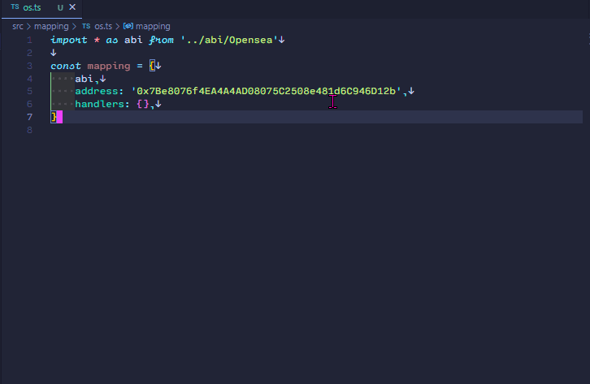

# CryptoPunks Subgraph migration

This is a squid submitted by @yat1ma30 for the [CryptoPunks Subgraph migration](https://github.com/subsquid-quests/cryptopunks-subgraph-migration) challenge.

## Usage

### Playground

https://app.subsquid.io/squids/yat1ma30-cryptopunks/v1

### Run locally

```bash
git clone <repo_url>
cd <repo_url>
npm ci
sqd up
sqd process &
sqd serve
```

## Refactoring for ease of use

I began to know TypeScript's types and extracting types from ABIs are useful (just a noob comment passed by).



## Test Queries

I've tested them all with JSON diff tools  already.

### CTokens

squid

```graphql
query MyQuery {
  cTokens(limit: 100, orderBy: id_ASC) {
    amount
    blockHash
    blockNumber
    from {
      id
    }
    id
    owner
    punkId
    referenceId
    timestamp
    to {
      id
    }
    txHash
  }
}
```

subgraph

```graphql
query MyQuery {
  ctokens(first: 100, orderBy: id, orderDirection: asc) {
    amount
    blockHash
    blockNumber
    from {
      id
    }
    id
    owner
    punkId
    referenceId
    timestamp
    to {
      id
    }
    txHash
  }
}
```

### Accounts

The Subgraph has some  bug.

e.g. wrong `numberOfPunksOwned` https://cryptopunks.app/cryptopunks/accountinfo?account=0x78f0269f5b1ca914c8c58993f41181f89e212b27

Squid

```graphql
query MyQuery {
  accounts(limit: 10, orderBy: numberOfPurchases_DESC) {
    id
    numberOfPurchases
    accountUrl
    averageAmountSpent
    numberOfSales
    numberOfTransfers
    totalEarned
    totalSpent
    numberOfPunksAssigned
    numberOfPunksOwned
  }
}
```

---

Subgraph

```graphql
query MyQuery {
  accounts(orderBy: numberOfPurchases, first: 10, orderDirection: desc) {
    id
    numberOfPurchases
    accountUrl
    averageAmountSpent
    numberOfSales
    numberOfTransfers
    totalEarned
    totalSpent
    numberOfPunksAssigned
    numberOfPunksOwned
  }
}
```

### Punks

The Subgraph doesn't record `contract` at all.

Squid

```graphql
query MyQuery {
  punks(limit: 10, orderBy: id_ASC) {
    id
    averageSalePrice
    numberOfSales
    numberOfTransfers
    totalAmountSpentOnPunk
    tokenId
    wrapped
    assignedTo {
      id
    }
    contract {
      id
    }
    currentAsk {
      id
    }
    currentAskCreated {
      id
    }
    currentAskRemoved {
      id
    }
    currentBid {
      id
    }
    currentBidCreated {
      id
    }
    currentBidRemoved {
      id
    }
    owner {
      id
    }
    metadata {
      id
    }
    purchasedBy {
      id
    }
  }
}
```

Subgraph

```graphql
query MyQuery {
  punks(orderBy: id, orderDirection: asc, first: 10) {
    id
    averageSalePrice
    numberOfSales
    numberOfTransfers
    totalAmountSpentOnPunk
    tokenId
    wrapped
    assignedTo {
      id
    }
    contract {
      id
    }
    currentAsk {
      id
    }
    currentAskCreated {
      id
    }
    currentAskRemoved {
      id
    }
    currentBid {
      id
    }
    currentBidCreated {
      id
    }
    currentBidRemoved {
      id
    }
    owner {
      id
    }
    metadata {
      id
    }
    purchasedBy {
      id
    }
  }
}
```


---


### MetaData

squid

```graphql
query MyQuery {
  metaData(limit: 10, orderBy: id_ASC) {
    contractURI
    id
    image
    svg
    tokenURI
    tokenId
    traits {
      id
      trait {
        id
        numberOfNfts
        type
      }
    }
    punk {
      id
    }
  }
}
```

subgraph

```graphql
query MyQuery {
  metaDatas(orderBy: id, first: 10, orderDirection: asc) {
    contractURI
    id
    image
    svg
    tokenId
    tokenURI
    traits {
      id
      numberOfNfts
      type
    }
    punk {
      id
    }
  }
}
```

### Asks

squid

```graphql
query MyQuery {
  asks(limit: 10, orderBy: id_ASC) {
    amount
    created {
      id
    }
    id
    from {
      id
    }
    nft {
      id
    }
    offerType
    open
    removed {
      id
    }
  }
}
```

subgraph

```graphql
query MyQuery {
  asks(first: 10, orderBy: id, orderDirection: asc) {
    amount
    created {
      id
    }
    id
    from {
      id
    }
    nft {
      id
    }
    offerType
    open
    removed {
      id
    }
  }
}
```

### Bids

squid

```graphql
query MyQuery {
  bids(limit: 10, orderBy: id_ASC) {
    amount
    created {
      id
    }
    id
    from {
      id
    }
    nft {
      id
    }
    offerType
    open
    removed {
      id
    }
  }
}
```

subgraph

```graphql
query MyQuery {
  bids(first: 10, orderBy: id, orderDirection: asc) {
    amount
    created {
      id
    }
    id
    from {
      id
    }
    nft {
      id
    }
    offerType
    open
    removed {
      id
    }
  }
}
```


## Contracts

squid

```graphql
query MyQuery {
  contracts(orderBy: id_ASC, limit: 10) {
    id
    imageHash
    name
    symbol
    totalAmountTraded
    totalSales
    totalSupply
  }
}

```

subgraph

```graphql
query MyQuery {
  contracts(first: 10, orderBy: id, orderDirection: asc) {
    id
    imageHash
    name
    symbol
    totalAmountTraded
    totalSales
    totalSupply
  }
}
```

### Assigns

squid

```graphql
query MyQuery {
  assigns(limit: 10, orderBy: id_ASC) {
    id
    amount
    blockHash
    blockNumber
    from {
      id
    }
    contract {
      id
    }
    logNumber
    nft {
      id
    }
    timestamp
    to {
      id
    }
    txHash
    type
  }
}

```

subgraph

```graphql
query MyQuery {
  assigns(first: 10, orderBy: id, orderDirection: asc) {
    id
    amount
    blockHash
    blockNumber
    from {
      id
    }
    contract {
      id
    }
    logNumber
    nft {
      id
    }
    timestamp
    to {
      id
    }
    txHash
    type
  }
}
```

### Sales

squid

```graphql
query MyQuery {
  sales(limit: 10, orderBy: id_ASC) {
    id
    amount
    blockHash
    blockNumber
    from {
      id
    }
    contract {
      id
    }
    logNumber
    nft {
      id
    }
    timestamp
    to {
      id
    }
    txHash
    type
  }
}

```

subgraph

```graphql
query MyQuery {
  sales(first: 10, orderBy: id, orderDirection: asc) {
    id
    amount
    blockHash
    blockNumber
    from {
      id
    }
    contract {
      id
    }
    logNumber
    nft {
      id
    }
    timestamp
    to {
      id
    }
    txHash
    type
  }
}
```

### AskCreateds

squid

```graphql
query MyQuery {
  askCreateds(limit: 10, orderBy: id_ASC) {
    id
    amount
    blockHash
    blockNumber
    from {
      id
    }
    contract {
      id
    }
    logNumber
    nft {
      id
    }
    timestamp
    to {
      id
    }
    txHash
    type
  }
}

```

subgraph

```graphql
query MyQuery {
  askCreateds(first: 10, orderBy: id, orderDirection: asc) {
    id
    amount
    blockHash
    blockNumber
    from {
      id
    }
    contract {
      id
    }
    logNumber
    nft {
      id
    }
    timestamp
    to {
      id
    }
    txHash
    type
  }
}
```


### BidCreated

squid

```graphql
query MyQuery {
  bidCreateds(limit: 10, orderBy: id_ASC) {
    id
    amount
    blockHash
    blockNumber
    from {
      id
    }
    contract {
      id
    }
    logNumber
    nft {
      id
    }
    timestamp
    to {
      id
    }
    txHash
    type
  }
}

```

subgraph

```graphql
query MyQuery {
  bidCreateds(first: 10, orderBy: id, orderDirection: asc) {
    id
    amount
    blockHash
    blockNumber
    from {
      id
    }
    contract {
      id
    }
    logNumber
    nft {
      id
    }
    timestamp
    to {
      id
    }
    txHash
    type
  }
}
```

### BidRemoved

squid

```graphql
query MyQuery {
  bidRemoveds(limit: 10, orderBy: id_ASC) {
    id
    amount
    blockHash
    blockNumber
    from {
      id
    }
    contract {
      id
    }
    logNumber
    nft {
      id
    }
    timestamp
    to {
      id
    }
    txHash
    type
  }
}

```

subgraph

```graphql
query MyQuery {
  bidRemoveds(first: 10, orderBy: id, orderDirection: asc) {
    id
    amount
    blockHash
    blockNumber
    from {
      id
    }
    contract {
      id
    }
    logNumber
    nft {
      id
    }
    timestamp
    to {
      id
    }
    txHash
    type
  }
}
```

### AskRemoveds

squid

```graphql
query MyQuery {
  askRemoveds(limit: 10, orderBy: id_ASC) {
    id
    amount
    blockHash
    blockNumber
    from {
      id
    }
    contract {
      id
    }
    logNumber
    nft {
      id
    }
    timestamp
    to {
      id
    }
    txHash
    type
  }
}

```

subgraph

```graphql
query MyQuery {
  askRemoveds(first: 10, orderBy: id, orderDirection: asc) {
    id
    amount
    blockHash
    blockNumber
    from {
      id
    }
    contract {
      id
    }
    logNumber
    nft {
      id
    }
    timestamp
    to {
      id
    }
    txHash
    type
  }
}
```

### Transfer

squid

```graphql
query MyQuery {
  transfers(limit: 10, orderBy: id_ASC) {
    id
    amount
    blockHash
    blockNumber
    from {
      id
    }
    contract {
      id
    }
    logNumber
    nft {
      id
    }
    timestamp
    to {
      id
    }
    txHash
    type
  }
}

```

subgraph

```graphql
query MyQuery {
  transfers(first: 10, orderBy: id, orderDirection: asc) {
    id
    amount
    blockHash
    blockNumber
    from {
      id
    }
    contract {
      id
    }
    logNumber
    nft {
      id
    }
    timestamp
    to {
      id
    }
    txHash
    type
  }
}
```

### Wraps

squid

```graphql
query MyQuery {
  wraps(limit: 10, orderBy: id_ASC) {
    id
    amount
    blockHash
    blockNumber
    from {
      id
    }
    contract {
      id
    }
    logNumber
    nft {
      id
    }
    timestamp
    to {
      id
    }
    txHash
    type
  }
}

```

subgraph

```graphql
query MyQuery {
  wraps(first: 10, orderBy: id, orderDirection: asc) {
    id
    amount
    blockHash
    blockNumber
    from {
      id
    }
    contract {
      id
    }
    logNumber
    nft {
      id
    }
    timestamp
    to {
      id
    }
    txHash
    type
  }
}
```

### Unwraps

squid

```graphql
query MyQuery {
  unwraps(limit: 10, orderBy: id_ASC) {
    id
    amount
    blockHash
    blockNumber
    from {
      id
    }
    contract {
      id
    }
    logNumber
    nft {
      id
    }
    timestamp
    to {
      id
    }
    txHash
    type
  }
}

```

subgraph

```graphql
query MyQuery {
  unwraps(first: 10, orderBy: id, orderDirection: asc) {
    id
    amount
    blockHash
    blockNumber
    from {
      id
    }
    contract {
      id
    }
    logNumber
    nft {
      id
    }
    timestamp
    to {
      id
    }
    txHash
    type
  }
}
```

### UserProxies

squid

```graphql
query MyQuery {
  userProxies(limit: 10, orderBy: id_ASC) {
    blockHash
    blockNumber
    id
    timestamp
    txHash
    user {
      id
    }
  }
}

```

subgraph

there is no user in subgraph

```graphql
query MyQuery {
  userProxies(first: 10, orderBy: id, orderDirection: asc) {
    blockHash
    blockNumber
    id
    timestamp
    txHash
    user {
      id
    }
  }
}
```
